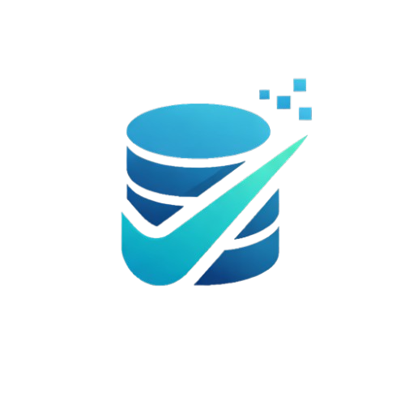

<div align="center">
  
  <h1>SQLvanta</h1>
  <p><strong>A Modern, Fast, and Open-Source Cross-Platform MySQL Client Built with Flutter.</strong></p>

  [](https://opensource.org/licenses/MIT)
  [](https://flutter.dev)
  []()
  [](https://sqlvanta.senthilnasa.me)
</div>

---

**SQLvanta** is an intuitive, highly performant cross-platform GUI client for MySQL and MariaDB databases. Designed for developers and database administrators, it provides an unparalleled developer experience with advanced features like a visual Schema Designer (ER Diagram), real-time Query Builder, and secure credential management—all rendered natively at 60+ FPS via the Flutter engine.

## ✨ Key Features

- **🚀 Native Performance**: Built natively for Windows, macOS, Linux, Android, iOS, and Web.
- **🎨 Interactive Schema Explorer**: Deep-dive into your database structures. Real-time search, collapsible tree views for tables, views, stored procedures, and triggers.
- **🗺️ Visual ERD Designer**: Auto-generate Entity-Relationship Diagrams across databases. Pan, zoom, drag cards, and export complex architectures directly to PNG.
- **💻 Pro-Grade SQL Editor**: Advanced query editor with intelligent syntax highlighting and autocomplete.
- **🗂️ Advanced Data Grid**: Infinity-scroll virtualization for large datasets via `pluto_grid`.
- **🔐 Secure Vault**: Industry-standard secure storage for your database passwords (OS keychain/DPAPI via `flutter_secure_storage`).
- **🌑 Light & Dark Mode**: Adapts perfectly to your system settings with carefully crafted color palettes.

## 📸 Screenshots

*(Add screenshots here)*
- **Workspace Dashboard**: ``
- **Schema Designer ERD**: ``
- **Data Results Grid**: ``

## 🚀 Getting Started

### Prerequisites
- [Flutter SDK](https://flutter.dev/docs/get-started/install) v3.29.3 or higher.
- [Dart SDK](https://dart.dev/get-dart) >=3.7.0.

### Installation

1. **Clone the repository**
   ```bash
   git clone https://github.com/yourusername/sqlvanta.git
   cd sqlvanta
   ```

2. **Install Dependencies**
   ```bash
   flutter pub get
   ```

3. **Run Code Generation** *(Required for Riverpod, Drift, and Freezed)*
   ```bash
   dart run build_runner build --delete-conflicting-outputs
   ```

4. **Launch the App**
   ```bash
   # Run on your preferred platform
   flutter run -d windows  # Windows
   flutter run -d macos    # macOS
   flutter run -d linux    # Linux
   flutter run -d chrome   # Web
   ```

## 🛠️ Tech Stack & Architecture

- **UI Framework**: [Flutter](https://flutter.dev) (Material 3 UI, FlexColorScheme)
- **State Management**: [Riverpod 2.x](https://riverpod.dev)
- **Local Persistence**: [Drift](https://drift.simonbinder.eu/) (SQLite)
- **MySQL Driver**: [mysql_client](https://pub.dev/packages/mysql_client) (Pure Dart, async connection pools)
- **Routing**: [GoRouter](https://pub.dev/packages/go_router)

## 🌎 SEO & Reach

SQLvanta is optimized to be the missing link in modern, open-source database administration. Whether you need a **Flutter database manager**, a **macOS MySQL GUI**, or a **Windows cross-platform SQL client**, SQLvanta aims to be your frictionless, go-to tool.

## 🤝 Contributing

Contributions are what make the open-source community such an amazing place to learn, inspire, and create. Any contributions you make are **greatly appreciated**.

1. Fork the Project
2. Create your Feature Branch (`git checkout -b feature/AmazingFeature`)
3. Commit your Changes (`git commit -m 'Add some AmazingFeature'`)
4. Push to the Branch (`git push origin feature/AmazingFeature`)
5. Open a Pull Request

## 📄 License

Distributed under the MIT License. See `LICENSE` for more information.

---
<div align="center">
  <sub>Built with ❤️ by the community.</sub>
</div>
